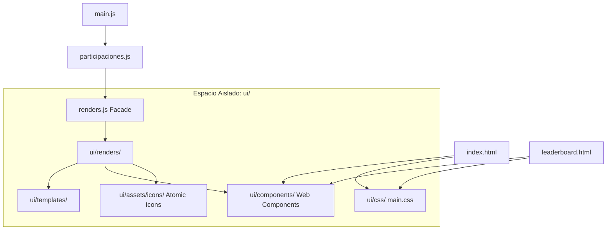

# Arquitectura del Sistema de Asistencia (Módulos UI/UX)

Este documento detalla la reestructuración arquitectónica realizada en la aplicación para modularizar los componentes visuales e interactivos, separándolos por completo de la lógica de negocio operativa.

---

## 🏗️ Principio del Desacoplamiento (Opción A)

El sistema original sufría de acoplamiento monolítico, donde la lógica de negocio (`participaciones.js`, `registrosExcel.js`), el marcado HTML (`index.html`) y las funciones de pintado de tablas (`renders.js`) compartían un único nivel jerárquico. 

Para resolverlo sin perturbar el código operativo existente, se implementó la **Opción A: Aislamiento Completo de UI/UX** bajo la carpeta raíz `ui/`.



---

## 🌟 Patrón Fachada (Facade Pattern)

Para asegurar la **compatibilidad absoluta con la lógica existente de Erick**, conservamos los archivos de entrada originales en la raíz del proyecto. Sin embargo, los hemos convertido en simples **puentes redireccionadores**:

1.  **`renders.js` (Raíz)**: 
    Actúa como fachada. Importa las funciones modularizadas desde `ui/renders/` y las vuelve a exportar con la misma firma original. Para `participaciones.js` y `main.js`, la API de pintado sigue siendo exactamente la misma.
2.  **`styles.css` (Raíz)**:
    Redirige toda la carga de estilos a la nueva arquitectura CSS modularizada mediante una directiva de importación única:
    ```css
    @import "./ui/css/main.css";
    ```

---

## 🔄 Flujo de Datos

1.  **Carga Inicial**: El navegador lee `index.html`, compila y registra los **Web Components Nativos** (`<brand-header>`, etc.) y ejecuta `main.js`.
2.  **Pintado**: `main.js` invoca a `renders.js` (fachada), la cual delega en `ui/renders/estudiantes.js`. Esta última utiliza las plantillas atómicas de `ui/templates/estudiantes.js` y genera la tabla inyectándola en el DOM.
3.  **Acciones y Actualizaciones**: Al sumar/restar participaciones, se ejecuta la lógica en `participaciones.js` e inmediatamente actualiza el badge específico llamando a `updateParticipacion()`, el cual gatilla una animación CSS local de destello en el badge del alumno.
