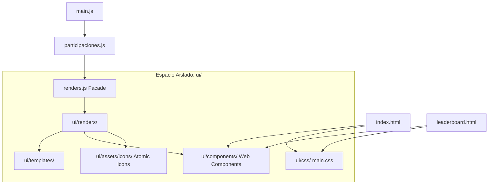

# Overview

Este documento detalla la reestructuración arquitectónica realizada en la aplicación para modularizar los componentes visuales e interactivos, separándolos por completo de la lógica de negocio operativa.

---

## 🏗️ Principio del Desacoplamiento (Opción A)

El sistema original sufría de acoplamiento monolítico, donde la lógica de negocio (`participaciones.js`, `registrosExcel.js`), el marcado HTML (`index.html`) y las funciones de pintado de tablas (`renders.js`) compartían un único nivel jerárquico.

Para resolverlo sin perturbar el código operativo existente, se implementó la **Opción A: Aislamiento Completo de UI/UX** bajo la carpeta raíz `ui/`.

