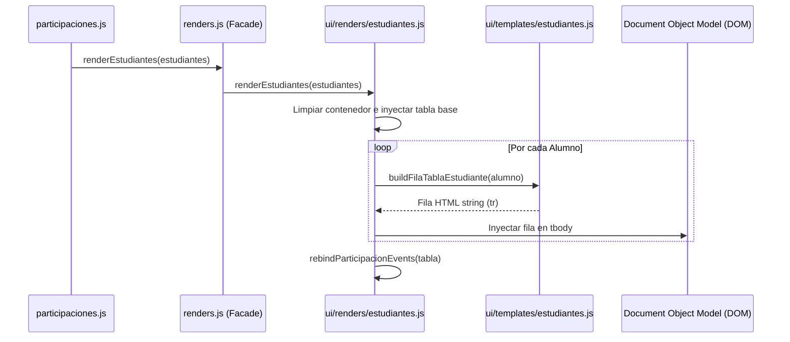

# Pipeline de Renderizado y Vinculación de Eventos

Este documento explica en detalle cómo la aplicación renderiza la tabla de alumnos de manera reactiva, maneja filtros dinámicos y soluciona el problema de desvinculación de eventos (clics) comunes en arquitecturas con JS Vanilla.

---

## 🔄 1. Pipeline de Renderizado de la Tabla

El proceso de dibujo de la lista de asistencia se activa desde el controlador `participaciones.js` e invoca a `ui/renders/estudiantes.js`:



---

## 🛠️ 2. El Desafío del Filtrado y los Eventos Dinámicos

En desarrollo Vanilla JS, cuando se realiza una búsqueda de estudiante (inputs `filtroNombre` / `filtroApellido`), la tabla existente se destruye del DOM y se crea una nueva. 

*   **El Problema**: Los event listeners de clics que asoció `main.js` en el arranque del sistema se destruyen junto con los elementos HTML viejos, provocando que los botones de sumar/restar participación dejen de funcionar.
*   **La Solución Modular**: Para corregir esto sin tocar `main.js`, implementamos la función interna **`rebindParticipacionEvents(container)`** dentro de `ui/renders/estudiantes.js`:
    ```javascript
    function rebindParticipacionEvents(container) {
      import("../../participaciones.js").then((module) => {
        const masBtns = container.querySelectorAll(".btn-mas");
        masBtns.forEach(btn => {
          btn.onclick = () => module.handleMarcarParticipacion(Number(btn.dataset.estudianteId));
        });
        
        const menosBtns = container.querySelectorAll(".btn-menos");
        menosBtns.forEach(btn => {
          btn.onclick = () => module.handleQuitarParticipacion(Number(btn.dataset.estudianteId));
        });
      });
    }
    ```
    Al finalizar el renderizado de la tabla (ya sea en carga inicial o después de escribir un filtro), se re-enlazan dinámicamente los clics directamente a los manejadores de `participaciones.js` importándolos bajo demanda para evitar dependencias circulares.

---

## ⚡ 3. Actualización Incremental e Interacciones

Para evitar redibujar toda la tabla (lo cual degrada el rendimiento de la CPU) cada vez que un alumno gana una participación:
1.  Se utiliza la función `updateParticipacion(estudianteId, numParticipacion)`.
2.  Busca mediante ID directo el badge de participación: `participaciones-${estudianteId}`.
3.  Actualiza su número en el DOM de forma quirúrgica.
4.  Aplica la clase CSS temporal `.participaciones-updated` que ejecuta una animación de destello y escala naranja al badge durante `500ms`.
